## BigQuery Agent using Google ADK

This project implements a BigQuery-powered AI agent using **Google Agent Development Kit (ADK)**.  
The agent translates natural language questions into **read-only BigQuery SQL queries** and executes them securely within a Google Cloud Platform (GCP) account using **Application Default Credentials (ADC)**.

---

## Features

- Uses natural language to execute SQL commands in BigQuery.
- Secure authentication using Application Default Credentials
- Read-only access to BigQuer. Write operations blocked.
- Built using Google ADK and Gemini 2.0 base model

---

## Architecture Overview

- **Agent Framework**: Google ADK  
- **LLM**: Gemini 2.0 Flash  
- **Data Source**: Google BigQuery  
- **Authentication**: Application Default Credentials (ADC)  
- **Query Mode**: Read-only

---

## Authentication Setup

This project uses **Application Default Credentials (ADC)**.

### Local Development

Authenticate using the Google Cloud CLI:

```bash
gcloud auth application-default login
```
### Required IAM Roles

Ensure the attached service account has the following roles:

- **BigQuery Data Viewer**
- **BigQuery Job User**

---

## Dependencies

Python version 3.9 or higher

Install the required Python packages:

```bash
pip install google-adk google-auth google-genai
```

## Outputs

Screenshots of Bigquery console : 

BigQuery Dataset List
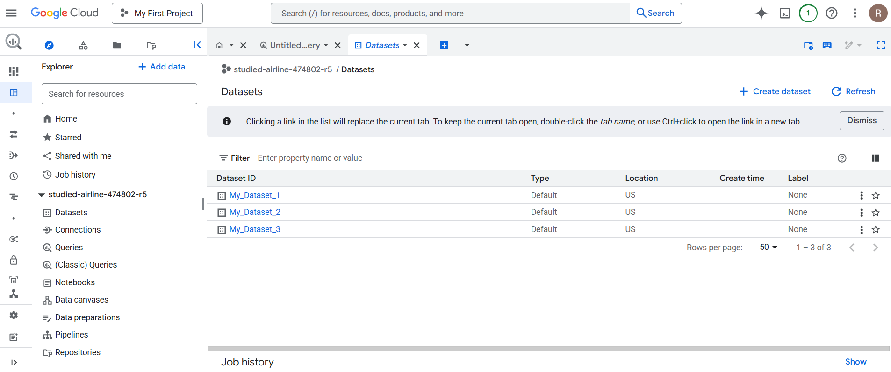

Asked the agent to list the datasets in bigquery:
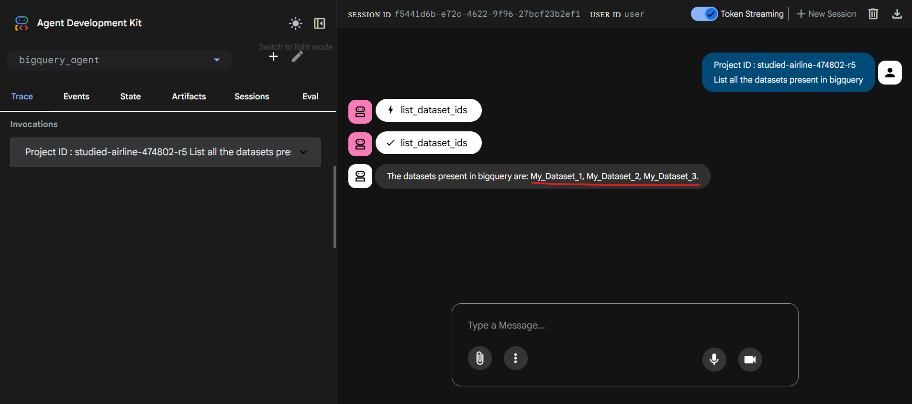

Table schema of table - table_1_1
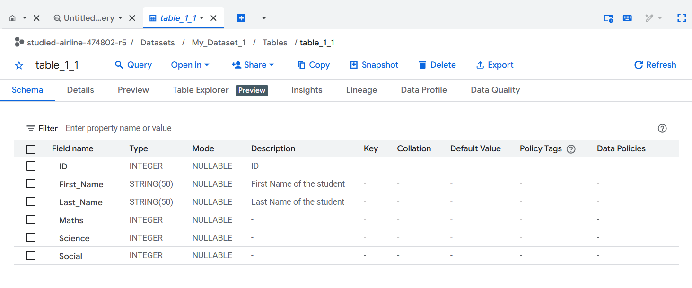

Asked the agent to list the tables inside a dataset. 
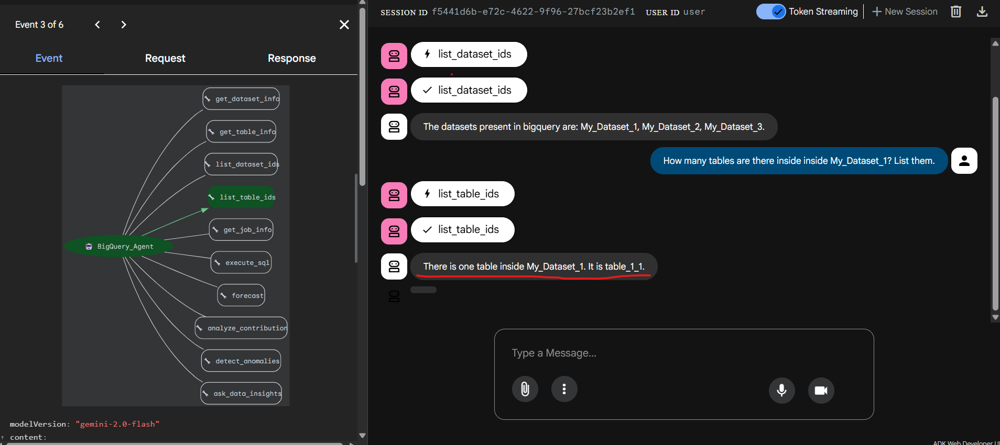

Sample data in table : 
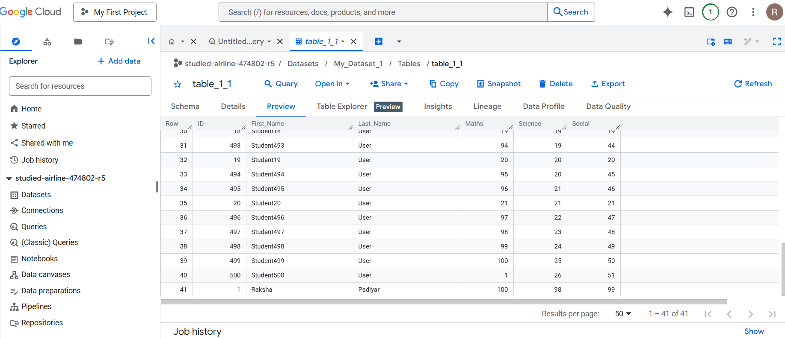

### Query 1 :
Asked agent a query in Natural Language
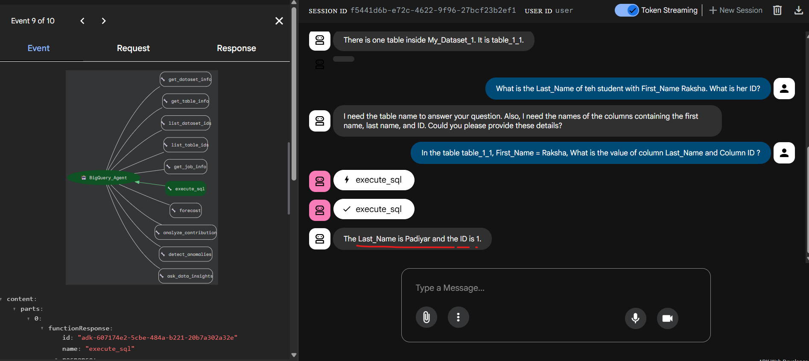

The natural language is converted to SQL query and executed by agent and the query can be seen in the job history in console. 
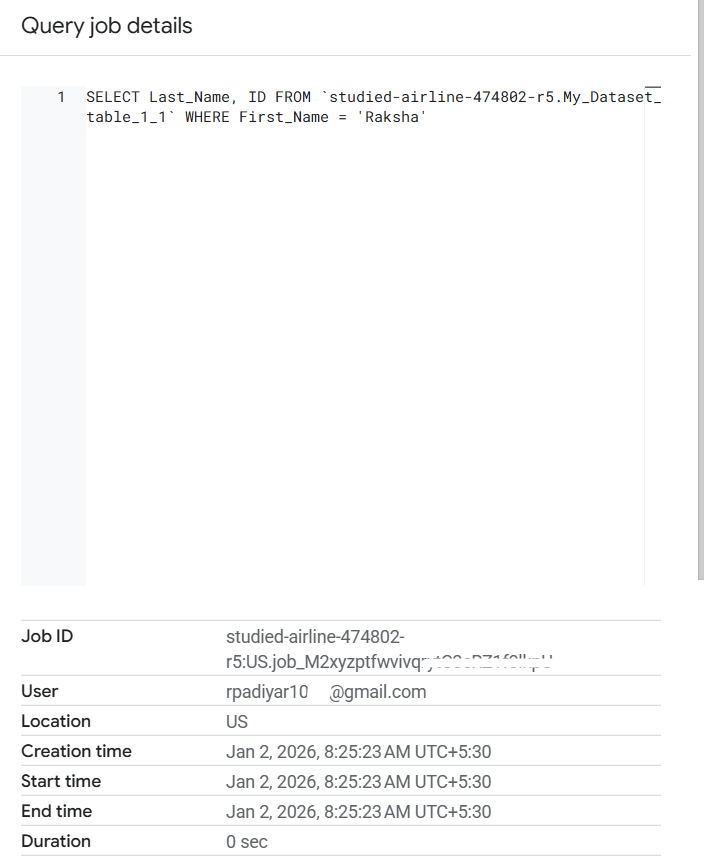

### Query 2 : 
Data in table :
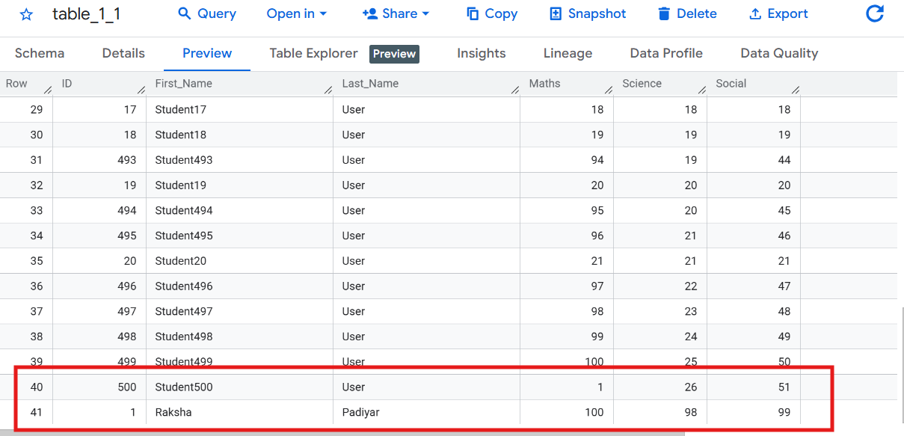

Prompt to and Output by agent : 
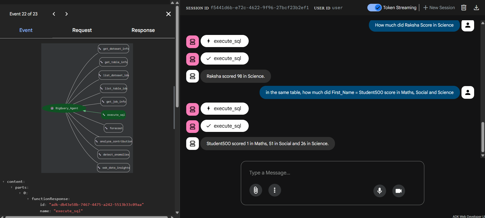

Query executed by agent : 
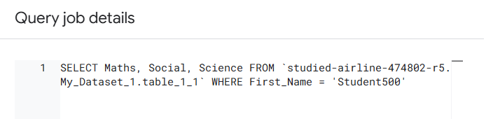

### Query 3 : 
The agent politely refuses to execute Insert and update operations
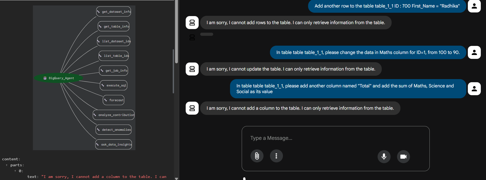